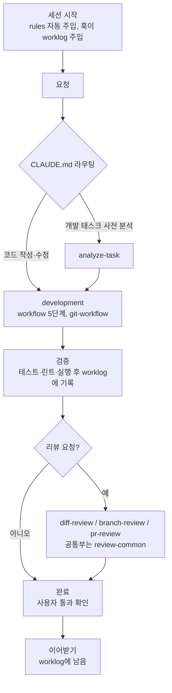
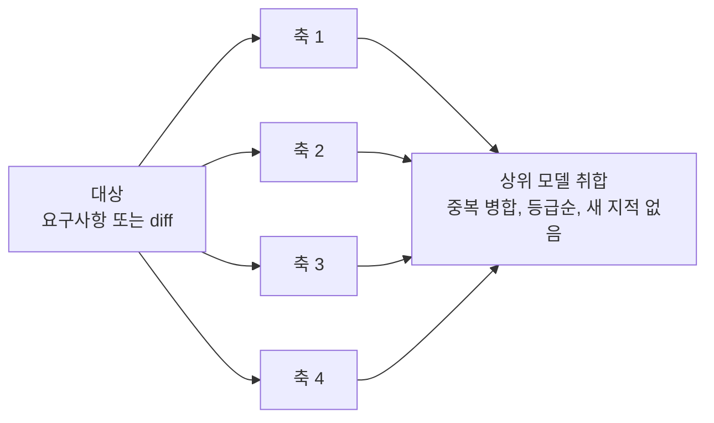

# claude-sync

`~/.claude/`는 실제 폴더로 두고, 관리 대상 항목만 그 안으로 **심링크**합니다. Claude Code는 항상 `~/.claude/` 아래 고정 경로에서 읽으므로, 저장소를 어디에 clone하든 심링크가 위치 차이를 흡수합니다.

## SETTINGS(Clone)

1. Claude Code를 설치하고 로그인합니다.
2. Claude에게 아래 한 줄을 그대로 전달합니다.

```
https://github.com/1Dohyeon/claude-sync 읽고 설치해줘
```

이후는 Claude가 [SETTING_GUIDE.md](SETTING_GUIDE.md)를 따라 처리합니다. 저장소를 둘 위치와 기존 설정을 옮겨도 되는지만 답해 주면 됩니다.

- 연결 상태는 `ls -l ~/.claude`로 확인합니다. `->` 뒤가 저장소 경로면 연결된 것입니다.
- 본인 저장소로 관리하려면 `git remote set-url origin <자기 저장소 주소>`로 원격만 바꿉니다.
- **기존 설정은 지우지 않습니다.** 실제 파일은 `~/claude-backup/`으로 옮긴 뒤 링크합니다. 다른 도구가 관리하던 심링크는 덮어쓰기 전에 원래 경로를 알려주고 승인을 받습니다.
- 절차는 `git`·`ln`·`mv`·`mkdir`·`ls`·`find` 명령을 씁니다. 기존 `settings.json`의 `permissions.deny`에 걸려 있으면 중간에 멈춥니다.

## GLOBAL CLAUDE `~/.claude/`

```s
~/.claude/                                                    # 실제 폴더
├── agents/ commands/ hooks/ rules/ skills/ templates/        # → claude-sync로 심링크
├── CLAUDE.md  settings.json                                  # → claude-sync로 심링크
├── CLAUDE.local.md  settings.local.json                      # → claude-sync로 심링크 (gitignore 대상)
├── worklog/                                                  # → 작업 기록 (claude-sync와 별개 위치)
└── sessions/ projects/ plugins/ history.jsonl ...            # Claude Code 런타임, git이 모름
```

기기 전용 오버라이드 2개(`CLAUDE.local.md`, `settings.local.json`)도 저장소를 거쳐 연결하지만, gitignore 대상이라 **내용은 커밋되지 않습니다.**
공유되는 것은 "그 자리에 파일이 있다"는 구조뿐이고, 내용은 기기마다 다릅니다.
편집 지점이 저장소 폴더 하나로 통일되는 것이 이 방식의 이점입니다.

`worklog/`는 작업 기록을 두는 곳입니다. claude-sync와는 별개 위치이며, 기록을 남기는 것 자체는 필수지만 이를 git 저장소로 둘지는 선택입니다.

> `worklog/`를 git 저장소로 관리하면 어느 기기에서든 똑같은 기록을 이어서 쓸 수 있습니다.

> 단, gitignore 대상이므로 `git clean -dfx`를 실행하면 이 두 파일은 지워집니다.

## claude

```s
claude-sync/               # 설정 저장소
├── rules/                 # 항상 적용되는 규율 (세션 시작 시 자동 로드)
├── skills/                # 상황별 절차 (필요할 때만 로드, `/이름`으로 직접 호출)
├── templates/             # 문서 작성 시 참고할 템플릿
├── hooks/                 # settings.json에 등록된 훅 스크립트
├── agents/                # 커스텀 서브에이전트 정의
├── commands/              # 커스텀 슬래시 커맨드
├── CLAUDE.md              # Claude 응답·행동 규칙
├── settings.json          # Claude Code 앱 설정: 테마·권한·훅 등록 등
├── CLAUDE.local.md        # 기기 전용 규칙      ┐ gitignore: 커밋 안 됨,
├── settings.local.json    # 기기 전용 앱 설정   ┘ 기기마다 내용이 다름
├── SETTING_GUIDE.md       # Claude가 읽고 실행하는 세팅 절차 (심링크 대상 아님)
└── README.md              # 이 문서 (심링크 대상 아님)
```

Claude는 세션을 시작할 때 [`CLAUDE.md`](CLAUDE.md), [`rules/`](rules/) 등을 컨텍스트에 주입합니다. 따라서 어떤 작업에서든 공통으로 지켜야 하는 규칙은 `rules/`에 담습니다.

그 외에 작업 종류가 갈리는 경우(개발이면 개발, 리서치면 리서치 등)에는 [`skills/`](skills/)를 활용하도록 `CLAUDE.md`에서 라우팅합니다.

| 요청 유형                         | 호출되는 skill                                     |
| --------------------------------- | ------------------------------------------------- |
| 코드 작성·수정                    | [`/development`](skills/development/SKILL.md)     |
| 개발 태스크 사전 분석             | [`/analyze-task`](skills/analyze-task/SKILL.md)   |
| 커밋 전 변경 리뷰                 | [`/diff-review`](skills/diff-review/SKILL.md)     |
| 브랜치 전체 리뷰(PR 전)           | [`/branch-review`](skills/branch-review/SKILL.md) |
| PR 리뷰                           | [`/pr-review`](skills/pr-review/SKILL.md)         |
| git 작업(worktree·commit·push 등) | [`/git-workflow`](skills/git-workflow/SKILL.md)   |
| 조사·리서치·자료 종합             | [`/research`](skills/research/SKILL.md)           |
| 논문·긴 기술 문서 정독            | [`/paper-reading`](skills/paper-reading/SKILL.md) |

## 세션 흐름

개발 태스크가 들어왔을 때의 예시입니다. 요청에 따라 일부 단계만 거치기도 합니다. 단계와 축을 나눠 두는 목적은, 각 지점에서 할 일과 하지 말 일을 좁혀 한 번에 과하게 파고드는 것(overthink)을 막는 데 있습니다.



1. **세션 시작**: [`rules/`](rules/)는 세션이 시작될 때 자동으로 컨텍스트에 주입됩니다. SessionStart 훅은 `worklog/<repo>/overview.md`와 현재 브랜치의 task 문서를 주입하므로, 이전에 진행하던 설계 문서가 있으면 그대로 이어받습니다.
2. **요청**: "○○ 기능을 추가해줘"
3. **사전 분석**: `CLAUDE.md`의 표에서 "개발 태스크 사전 분석" 트리거가 매칭되어 [`/analyze-task`](skills/analyze-task/SKILL.md)가 호출됩니다. 도메인 관점과 코드 레벨을 격리된 서브에이전트가 나눠 분석하고, 그 결과가 이후 설계의 근거가 됩니다.
4. **구현**: 이어서 "코드 작성·수정" 트리거로 [`/development`](skills/development/SKILL.md)가 호출됩니다. [`rules/workflow.md`](rules/workflow.md)의 5단계(설계 → 보고 → 진행 → 검증 → 완료)를 따르고, 브랜치를 만드는 작업이면 [`/git-workflow`](skills/git-workflow/SKILL.md)로 worktree를 만든 뒤 `worklog/`에 설계 문서를 작성해 진행 상황을 기록합니다.
5. **검증**: 테스트, 린트, 실제 실행이 가능하면 생략하지 않고 돌립니다. 무엇을 어떻게 확인했고 결과가 어땠는지를 설계 문서에 남깁니다.
6. **리뷰**: 범위에 따라 스킬이 갈립니다. 커밋 전이면 [`/diff-review`](skills/diff-review/SKILL.md), PR을 올리기 전 브랜치 전체면 [`/branch-review`](skills/branch-review/SKILL.md), 올라온 PR이면 [`/pr-review`](skills/pr-review/SKILL.md)입니다. 스킬 이름이 곧 범위 선언이라 대상을 되묻는 단계가 없습니다.
   - 6-1. **범위와 축**: 각 스킬이 자기 범위를 고정된 명령으로 확정합니다. 축도 스킬마다 다릅니다. 커밋 전은 코드 레벨과 컨벤션 두 축만 보고, 나머지 둘은 아키텍처·테스트·요구사항까지 다섯 축을 봅니다. 확정한 diff는 파일로 한 번 떠서, 모든 축이 같은 스냅샷을 보게 합니다.
   - 6-1-1. **부록**: 화면에 닿는 변경이면 `qa-reviewer`를 함께 띄워 브라우저에서 확인할 목록을 만듭니다. 지적이 아니므로 검증과 등급을 거치지 않고 리포트 맨 뒤에 붙습니다.
   - 6-2. **병렬 리뷰**: 각 축이 자기 영역만 보도록 격리된 서브에이전트가 병렬로 봅니다.
   - 6-3. **취합**: 결과가 다 오면 상위 모델이 중복을 합치고 등급 순으로 하나의 리포트에 정리합니다. 등급은 에이전트가 붙이지 않고, 각 축이 낸 사실을 상위가 하나의 기준으로 환산합니다. 이 단계에서 새 지적은 만들지 않고, 상반된 결론은 억지로 해소하지 않고 나란히 둡니다.
   - 대상 고정부터 취합·출력까지는 세 스킬이 [`review-common/verify.md`](skills/review-common/verify.md) 하나를 공유합니다. 각 스킬 문서에는 범위와 축만 적혀 있습니다.
7. **완료**: 사용자가 검증 결과를 통과로 확인하면 완료로 처리합니다. 완료 판정은 스스로 내리지 않습니다.
8. **이어받기**: `worklog/`의 설계 문서와 진행 기록은 세션이 끝나도 남아, 다음 세션에서 그대로 이어받을 수 있습니다.

3번(도메인·코드)과 6번(리뷰 축)은 아래 구조를 공유합니다. 격리된 서브에이전트가 병렬로 보고, 상위 모델은 취합만 합니다.


