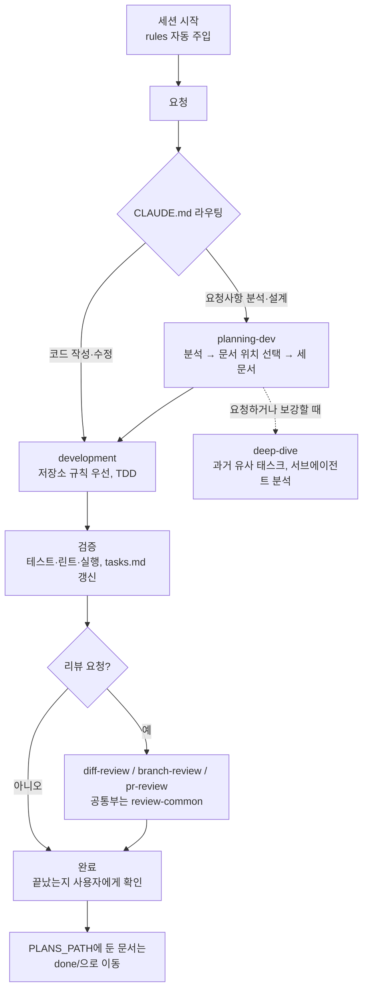

# claude-sync

`~/.claude/`는 실제 폴더로 두고, 관리 대상 항목만 그 안으로 **심링크**합니다. Claude Code는 항상 `~/.claude/` 아래 고정 경로에서 읽으므로, 저장소를 어디에 clone하든 심링크가 위치 차이를 흡수합니다.

## SETTINGS(Clone)

1. Claude Code를 설치하고 로그인합니다.
2. Claude에게 아래 한 줄을 그대로 전달합니다.

```
https://github.com/1Dohyeon/claude-sync 읽고 설치해줘
```

이후는 Claude가 [SETTING_GUIDE.md](SETTING_GUIDE.md)를 따라 처리합니다. 저장소를 둘 위치와 기존 설정을 옮겨도 되는지만 답해 주면 됩니다.

- 연결 상태는 `ls -l ~/.claude`로 확인합니다. `->` 뒤가 저장소 경로면 연결된 것입니다.
- 본인 저장소로 관리하려면 `git remote set-url origin <자기 저장소 주소>`로 원격만 바꿉니다.
- **기존 설정은 지우지 않습니다.** 실제 파일은 `~/claude-backup/`으로 옮긴 뒤 링크합니다. 다른 도구가 관리하던 심링크는 덮어쓰기 전에 원래 경로를 알려주고 승인을 받습니다.
- 절차는 `git`·`ln`·`mv`·`mkdir`·`ls`·`find` 명령을 씁니다. 기존 `settings.json`의 `permissions.deny`에 걸려 있으면 중간에 멈춥니다.
- [`/planning-dev`](skills/planning-dev/SKILL.md)의 깊은 분석에서 과거 유사 태스크를 찾으려면 `kiwipiepy`·`scikit-learn`이 필요합니다. 없으면 그 검색만 건너뜁니다.

## GLOBAL CLAUDE `~/.claude/`

```s
~/.claude/                                                    # 실제 폴더
├── agents/ commands/ hooks/ rules/ skills/ templates/        # → claude-sync로 심링크
├── CLAUDE.md  settings.json                                  # → claude-sync로 심링크
├── CLAUDE.local.md  settings.local.json                      # → claude-sync로 심링크 (gitignore 대상)
└── sessions/ projects/ plugins/ history.jsonl ...            # Claude Code 런타임, git이 모름
```

기기 전용 오버라이드 2개(`CLAUDE.local.md`, `settings.local.json`)도 저장소를 거쳐 연결하지만, gitignore 대상이라 **내용은 커밋되지 않습니다.**
공유되는 것은 "그 자리에 파일이 있다"는 구조뿐이고, 내용은 기기마다 다릅니다.
편집 지점이 저장소 폴더 하나로 통일되는 것이 이 방식의 이점입니다.

> 단, gitignore 대상이므로 `git clean -dfx`를 실행하면 이 두 파일은 지워집니다.

`~/plans/`는 계획 문서를 둘 수 있는 곳 가운데 하나입니다. 경로는 [`rules/environments.md`](rules/environments.md)의 `PLANS_PATH`로 바꿀 수 있으며, `~/.claude/`와 claude-sync 밖의 별개 위치입니다.

## claude

```s
claude-sync/               # 설정 저장소
├── rules/                 # 항상 적용되는 규율 (세션 시작 시 자동 로드)
├── skills/                # 상황별 절차 (필요할 때만 로드, `/이름`으로 직접 호출)
├── templates/             # 문서 작성 시 참고할 템플릿
├── hooks/                 # settings.json에 등록된 훅 스크립트
├── agents/                # 커스텀 서브에이전트 정의
├── commands/              # 커스텀 슬래시 커맨드
├── CLAUDE.md              # Claude 응답·행동 규칙
├── settings.json          # Claude Code 앱 설정: 테마·권한·훅 등록 등
├── CLAUDE.local.md        # 기기 전용 규칙      ┐ gitignore: 커밋 안 됨,
├── settings.local.json    # 기기 전용 앱 설정   ┘ 기기마다 내용이 다름
├── SETTING_GUIDE.md       # Claude가 읽고 실행하는 세팅 절차 (심링크 대상 아님)
└── README.md              # 이 문서 (심링크 대상 아님)
```

Claude는 세션을 시작할 때 [`CLAUDE.md`](CLAUDE.md), [`rules/`](rules/) 등을 컨텍스트에 주입합니다. 따라서 어떤 작업에서든 공통으로 지켜야 하는 규칙은 `rules/`에 담습니다.

그 외에 작업 종류가 갈리는 경우(개발이면 개발, 리서치면 리서치 등)에는 [`skills/`](skills/)를 활용하도록 `CLAUDE.md`에서 라우팅합니다.

| 요청 유형                         | 호출되는 skill                                    |
| --------------------------------- | ------------------------------------------------- |
| 코드 작성·수정                    | [`/development`](skills/development/SKILL.md)     |
| 요청사항 분석·설계                | [`/planning-dev`](skills/planning-dev/SKILL.md)   |
| 커밋 전 변경 리뷰                 | [`/diff-review`](skills/diff-review/SKILL.md)     |
| 브랜치 전체 리뷰(PR 전)           | [`/branch-review`](skills/branch-review/SKILL.md) |
| PR 리뷰                           | [`/pr-review`](skills/pr-review/SKILL.md)         |
| git 작업(worktree·commit·push 등) | [`/git-workflow`](skills/git-workflow/SKILL.md)   |
| 조사·리서치·자료 종합             | [`/research`](skills/research/SKILL.md)           |
| 논문·긴 기술 문서 정독            | [`/paper-reading`](skills/paper-reading/SKILL.md) |
| 세션 작업 일기                    | [`/worklog`](skills/worklog/SKILL.md)             |

## 세션 흐름

개발 태스크가 들어왔을 때의 예시입니다. 요청에 따라 일부 단계만 거치기도 합니다. 단계와 축을 나눠 두는 목적은, 각 지점에서 할 일과 하지 말 일을 좁혀 한 번에 과하게 파고드는 것(overthink)을 막는 데 있습니다.


```mermaid
flowchart TD
    A["세션 시작<br/>rules 자동 주입"] --> B["요청"]
    B --> C{"CLAUDE.md 라우팅"}
    C -->|"요청사항 분석·설계"| D["planning-dev<br/>분석 → 문서 위치 선택 → 세 문서"]
    C -->|"코드 작성·수정"| E["development<br/>저장소 규칙 우선, TDD"]
    D -.->|"요청하거나 보강할 때"| DD["deep-dive<br/>과거 유사 태스크, 서브에이전트 분석"]
    D --> E
    E --> F["검증<br/>테스트·린트·실행, tasks.md 갱신"]
    F --> G{"리뷰 요청?"}
    G -->|"예"| H["diff-review / branch-review / pr-review<br/>공통부는 review-common"]
    G -->|"아니오"| I["완료<br/>끝났는지 사용자에게 확인"]
    H --> I
    I --> J["PLANS_PATH에 둔 문서는<br/>done/으로 이동"]
```

1. **세션 시작**: [`rules/`](rules/)는 자동으로 주입되고, 계획 문서는 필요할 때 [`/planning-dev`](skills/planning-dev/SKILL.md)의 "계획 문서 찾기" 순서로 찾아 읽습니다.
2. **요청**: "○○ 요청사항 분석해줘"
3. **분석**: [`/planning-dev`](skills/planning-dev/SKILL.md)가 목적, 유형, 규모, 할 일을 보고합니다. 깊은 분석은 요청하거나 계획 문서를 보강할 때만 합니다.
4. **계획 문서**: 문서를 둘 위치를 묻고, `requirements.md`·`design.md`·`tasks.md`를 모두 쓴 뒤 한 번에 확인받습니다.
5. **구현**: [`/development`](skills/development/SKILL.md)가 저장소 규칙을 우선하며 TDD로 작업하고, 작업 브랜치는 [`/git-workflow`](skills/git-workflow/SKILL.md)대로 만듭니다.
6. **검증**: 테스트, 린트, 실제 실행으로 확인하고 `tasks.md`를 갱신합니다.
7. **리뷰**: 커밋 전이면 [`/diff-review`](skills/diff-review/SKILL.md), PR을 올리기 전 브랜치 전체면 [`/branch-review`](skills/branch-review/SKILL.md), 올라온 PR이면 [`/pr-review`](skills/pr-review/SKILL.md)입니다. 축 구성과 그렇게 나눈 이유는 [`skills/review-common/README.md`](skills/review-common/README.md)에 있습니다.
8. **완료**: 사용자가 끝났다고 확인하면 `tasks.md`를 완료로 바꾸고, `$PLANS_PATH`에 둔 문서는 `done/`으로 옮깁니다.
9. **이어받기**: 다음 세션은 위치를 묻지 않고 정해진 순서로 계획 문서를 찾아 이어서 작업합니다.
